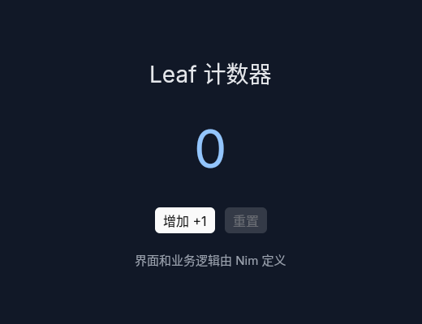

# Leaf · Nim + GPUI

Leaf 用 **Nim** 定义桌面应用的组件、状态和事件，由 **GPUI** 创建窗口和渲染界面，并使用 **GPUI Kit** 的按钮、输入框、复选框、开关等组件。Rust 桥接层连接 Nim 与 GPUI；应用业务代码使用 Nim。

[](https://github.com/SatoriTours/Leaf/actions/workflows/ci.yml)



## 快速开始

需要 **Nim 2.2.6+、Rust 1.92+、C/C++ 编译器**。固定使用 **GPUI Kit 0.7.0**，其 GPUI 快照版本由 Kit 和 `Cargo.lock` 锁定。[GPUI Kit 上游](https://github.com/longbridge/gpui-kit)

Ubuntu/Debian 的构建与窗口依赖：

```sh
sudo apt-get install build-essential pkg-config cmake libssl-dev libclang-dev \
  libfontconfig1-dev libfreetype6-dev \
  libxkbcommon-dev libxkbcommon-x11-dev libxcb1-dev libx11-xcb-dev \
  libwayland-dev libvulkan-dev fonts-noto-cjk
cargo build --locked -p leaf-gpui
nim c -d:release --out:target/nim/leaf src/leaf_cli.nim
./target/nim/leaf examples/counter.nim
```

CLI 会增量构建 GPUI 桥接库，并将它复制到应用可执行文件旁。也可以直接执行 `nim c -r examples/counter.nim`；此时先运行上面的 Cargo 构建。

无窗口验证和回调测试：

```sh
./target/nim/leaf --check examples/counter.nim
./target/nim/leaf --headless --click add --click add examples/counter.nim
```

发布后的应用包含 GPUI 桥接库，运行者无需安装 Nim 或 Rust。窗口仍需要系统图形驱动、字体以及可用图形会话。

## 用 Nim 描述界面

```nim
import leaf

var count = 0

proc render(ctx: BuildContext): Node =
  view:
    column:
      styles: {"padding": "24", "gap": "12"}
      text "计数：" & $count
      button "增加":
        key: "add"
        onClick(e): inc count

let app = Application(title: "Nim + GPUI", width: 640, height: 480, render: render)

when isMainModule: quit(run(app))
```

`view:` 用缩进表达组件树，属性使用 `styles:`、`key:` 等写法；事件块 `onClick(e):` 接收 `Event`，布局中可直接使用 `if`、`for` 和子组件。组件包括 Column、Row、Text、Button、Input、Checkbox、Switch、Progress、Tag、Separator、Spinner 和 VirtualList。输入框按稳定 key 复用 GPUI Kit `InputState`；虚拟列表按视口向 Nim 请求行，避免创建全部十万项控件。事件更新失败时保留上一份成功界面，并显示错误信息。

## 开发与发布

```sh
./target/nim/leaf init my-app
./target/nim/leaf my-app
./target/nim/leaf --watch my-app
./target/nim/leaf doctor --json
./target/nim/leaf pack my-app --target linux --output dist
```

项目支持 Nim 模块、资源和 `leaf.json`。watch 编译成功且 GPUI 窗口就绪后才替换旧程序。打包生成 Linux tar.gz、macOS .app ZIP 或 Windows ZIP，包含可执行文件、GPUI 桥接库、资源、许可证和 SHA256。跨平台打包需要相应目标的应用和桥接库。[开发说明](docs/development.md) · [发布说明](docs/packaging.md)

`examples/` 提供计数器、待办、子组件、错误恢复和 Kit 控件示例；`example/main.nim` 提供仪表盘、看板、行情、报表、聊天、注册与设置页面。页面数据与操作为本地模拟。

## 测试

完整回归还需要 Python 3.12+（用标准库独立校验流式发布归档）；Linux 桌面测试需要 Xvfb 和 xdotool。

```sh
cargo test --workspace --locked
nim c -r --out:target/nim/test_runner scripts/test.nim
# Linux：真实窗口、鼠标、键盘及 Nim 回调，需要 X11 或 Xvfb 和 xdotool
nim c -r --out:target/nim/native_test scripts/native_test.nim
```

GPUI 测试覆盖实际 Kit 控件、禁用交互、输入实体与选区保留、中文文本和 Enter 提交。真实桌面测试独立于 headless 回归。性能与平台证据见[验证记录](docs/verification.md)。

## 目录

| 路径 | 内容 |
| --- | --- |
| `src/leaf` | Nim 组件、状态、事件、桥接、CLI 与发布工具 |
| `crates/leaf-gpui` | GPUI + GPUI Kit 的 Rust 桌面桥接层 |
| `examples` / `example` | Nim 应用示例 |
| `tests/nim` | Nim 核心、工具、ABI 和真实窗口测试 |
| `docs` | [架构](docs/architecture.md)、[Nim API](docs/nim-api.md)与开发文档 |

Leaf 使用 MIT 许可。GPUI/GPUI Kit 及相关依赖的许可证信息见 `src/leaf/vendor/GPUI-NOTICES.json`，发布工具将该清单与随依赖提供的许可证文本写入发布包。
