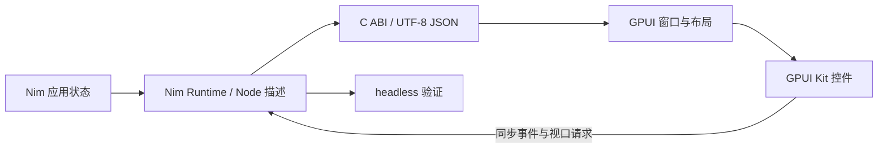

# Nim + GPUI 架构

Nim 管理应用状态、组件闭包、不可变描述、稳定身份、缓存、事件回调和虚拟列表。Rust 动态库通过 GPUI 创建窗口，使用 GPUI Kit 的控件和资源完成绘制、布局、输入与焦点管理。

`core.nim` 校验和发布完整候选树，`gpui_styles.nim` 校验桌面样式。`gpui_bridge.nim` 保留 Runtime 与返回缓冲区；`gpui_api.nim` 延迟加载 `leaf-gpui` 动态库。`desktop.rs` 协调控件，`styles.rs` 转换 GPUI 样式，`lists.rs` 使用 GPUI 原生虚拟列表按需请求 Nim 行描述。

C ABI 版本为 1。`leaf_gpui_run` 同步运行主循环，Nim owner 在整个调用期间存活。回调请求和响应均为 UTF-8 JSON；Rust 在下次请求前完成响应复制与反序列化。Nim 异常在回调内捕获；Rust 导出入口捕获 panic 并返回非零状态。双方在同一 UI 线程运行，后台线程不访问 Nim 闭包。

业务 render 在初始化与事件更新时执行。GPUI 重绘读取缓存描述；视口变更只构建所需列表行。输入实体按稳定 ID 保存，模型值不变时避免 `set_value`，保留选区、撤销与输入法组合状态。过时、禁用及无处理器的事件不执行回调。更新失败保留成功描述和回调，并展示错误信息。

CLI 通过 Cargo 增量构建桥接库，再通过 Nim 编译业务程序。桥接库放在应用可执行文件旁，发布包使用相同布局。headless 路径不初始化 GPUI、不加载桥接库。图形系统、驱动与字体属于平台运行依赖。
