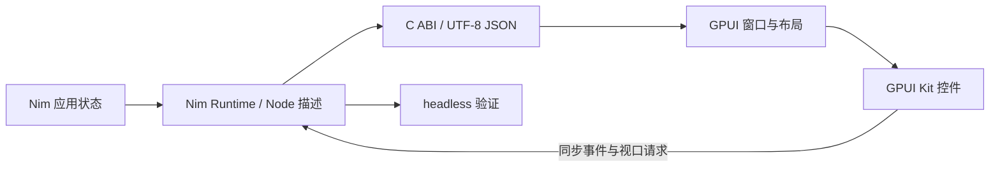

# Nim + GPUI 架构

Nim 管理应用状态、组件闭包、不可变描述、稳定身份、缓存、事件回调和虚拟列表。Rust 动态库通过 GPUI 创建窗口，使用 GPUI Kit 的控件和资源完成绘制、布局、输入与焦点管理。

```mermaid
flowchart LR
    A[Nim 应用状态] --> B[Nim Runtime / Node 描述]
    B --> C[C ABI / UTF-8 JSON]
    C --> D[GPUI 窗口与布局]
    D --> E[GPUI Kit 控件]
    E -->|同步事件与视口请求| B
    B --> F[headless 验证]
```

`core.nim` 校验和发布完整候选树，`gpui_styles.nim` 校验桌面样式。`gpui_bridge.nim` 保留 Runtime 与返回缓冲区；`gpui_api.nim` 延迟加载 `leaf-gpui` 动态库。`desktop.rs` 协调控件，`styles.rs` 转换 GPUI 样式，`lists.rs` 使用 GPUI 原生虚拟列表按需请求 Nim 行描述。

C ABI 版本为 1。`leaf_gpui_run` 同步运行主循环，Nim owner 在整个调用期间存活。回调请求和响应均为 UTF-8 JSON；Rust 在下次请求前完成响应复制与反序列化。Nim 异常在回调内捕获；Rust 导出入口捕获 panic 并返回非零状态。双方在同一 UI 线程运行，后台线程不访问 Nim 闭包。

业务 render 在初始化与事件更新时执行。GPUI 重绘读取缓存描述；视口变更只构建所需列表行。输入实体按稳定 ID 保存，模型值不变时避免 `set_value`，保留选区、撤销与输入法组合状态。过时、禁用及无处理器的事件不执行回调。更新失败保留成功描述和回调，并展示错误信息。

CLI 通过 Cargo 增量构建桥接库，再通过 Nim 编译业务程序。桥接库放在应用可执行文件旁，发布包使用相同布局。headless 路径不初始化 GPUI、不加载桥接库。图形系统、驱动与字体属于平台运行依赖。

## A1 原生公共边界（已实现并通过 Nim 测试）

以下范围由 `scripts/test.nim` 中的 Nim 套件实际验证，不代表任何原生平台已验收：

- `styles.nim`：旧字符串 Styles 的后端中立语法校验与有类型转换（`Dimension` auto/fixed/fill、RGBA、layout/control/accessibility props；`Option` 区分未指定与显式值）。
- `core.nim` 提交门：`setCommitter` / `acceptedRevision` / `proposedRevision` / `stagingChanged` / `freezeEvents`。顺序为构建 → 校验 → preparer → committer → 发布；后端拒绝时不发布树、索引、缓存或 revision，业务对象不回滚。
- `backend.nim`：能力表、不透明 `NodeHandle`、`MountedEntity`、create/update/move/remove 批次、同步 Backend 契约与 `HostContext`；`checkCapabilities` / `effectiveProps` 区分必需能力与可降级装饰。
- `reconcile.nim`：纯差异协调器。身份按父子结构复用，祖先换类型会重建全部后代；同父变序生成可顺序应用的 handle 索引；过期或外来 plan 被拒绝（私有 owner 与 accepted-state generation）。
- `backend_session.nim` + `backends/headless.nim`：记录型 Backend 与会话。事件队列只在显式 `drainEvents` 处理；setter 通知被抑制；apply 失败恢复旧 accepted 实体并推进 mount generation，恢复失败则冻结 Runtime 业务 dispatch。列表按 handle + source generation 请求，视口按 item key 跨 source 恢复。会话关闭若发生在 Runtime 更新中会以可捕获 `UiError` 明确拒绝，host 应在安全 tick 重试；一旦开始 teardown 即进入 event-ineligible，旧队列失效，`enqueue`/`drainEvents`/`requestRows` 不再触达业务，`backend.dispose` 失败仍可重试。hook 按所有权 token 卸载，`clearCommitter`/`clearPreparer` 与安装同样经过 executionScope 和更新期 guard，不误清他人 hook。
- `-d:leafHeadlessOnly`：runner 不导入 desktop；无参数明确返回非零，不静默打开窗口。headless 构建不链接 GPUI / Vulkan。

安装 hook 时，候选与 hook/owner 在 executionScope 成功退出后才发布，安装期 guard 包含 Scope 退出阶段。`installCommitter` 的可选 `RuntimeInstallLifecycle`（confirm/abort）与 committer owner 一起保存和卸载；原二参数调用和 RuntimeCommitter 签名保持兼容。正式 BackendSession 自动注册该生命周期，因此直接调用 Runtime 的 `installPreparer` / `setPreparer` 也会将 Native apply 后的 plan 保持 pending，Scope 成功后才确认 Session/reconciler 和 Runtime 的接受状态。Scope 后置错误在合法 Scope 中恢复旧 Native 描述、推进监听代际；恢复失败或恢复 Scope 拒绝执行 body 时 fault/freeze。后者仅执行 framework 故障标记，不绕过 Scope 恢复 Native 或卸载 hook。confirm 只发布 framework metadata，不调用业务/Native；任意旧式外部 committer 的业务副作用不属于补偿合同。

Backend 实例通过私有资源占用 token 拒绝跨 Runtime 的同时使用。占用拒绝不 prepare/apply/dispose 输入实例；attach 只清理本次实际取得的资源。清理错误附加到 primary 异常；若合法 Scope 未能移除本次 hook，则保留仍被引用的 Backend 并报告失败。成功 Session dispose 后释放占用，失败关闭仍可重试。

输入法 / composition、导航历史、移动生命周期与 SQLite、Canvas、原生构建与实机验收不在 A1 范围。

## A2 T1：平台消费最小协议与受控编辑状态机（additive）

以下为 Native 平台消费所需的最小可选协议，已由 Nim 测试验证；不代表任何原生平台已验收。

- `core.nim`：`Event.composition: CompositionPhase`（默认 `compositionNone`）。不新增 `EventKind`，旧 `value`/`checked` 与 snapshot 事件 JSON 形状不变。
- `styles.nim` / `widgets.nim`：`input(..., resetToken = 0)` 仅在末尾追加可选参数；非零时在 attributes 输出 `input_reset_token` 十进制字符串，0/省略不产生属性。`ControlProps.resetToken: Option[uint64]` 只接受 input 的无符号十进制 0..high(uint64)，负数/溢出/浮点/错 kind 均报错，不走 float style 路径。
- `backend.nim`：`ControlFeature`/`BackendCapabilities.controls` 为必需能力，`cfInputReset` 由 `fullCapabilities` 声明；非零 reset token 在 compatible 也不降级，缺失直接拒绝。新增可选 hook `accepted`（纯 framework metadata）、`rebind`、`bindingValid`、`settle`，原五必需字段与旧调用保持兼容。
- `backend_session.nim`：`EventEnvelope.bindingGeneration` 默认 0；`bindingValid` 非 nil 时 enqueue 与 process 均复查。`accepted` 仅在成功 accept 后通知（install confirm 无额外 Native apply）。restore 后推进 generation、清队列/sequence 并 `rebind`，失败与 restore 失败同样 fault+freeze。事件处理后、Runtime Scope 完全返回且实体/绑定仍有效时通过 `settle` 结算最新 accepted props；settle 失败 fault+freeze 并停止剩余批。
- `native_edit.nim`：纯 `EditorState` 状态机（无原生资源）。`settleEditor` 处理普通 ack（同文本不 setText、保留选区/组合；拒绝/格式化同步 accepted 值；组合期不写冲突，`compositionEnd` 按最终模型同步）。`resetEffects` 为显式同值 ack 例外，输出 ForceCancel→forced setText→末尾选区；`completeReset` 仅在 Native 效果全部成功后消费 token。
- `gpui_bridge.nim`：旧桥接在独立 validator 分支拒绝显式非零 reset token；`gpui_styles` 保持 style-only，不全面强验旧 control 属性。

## A2 T2：有限 DIP 线性布局与 Win32 能力边界

- `native_layout.nim`：纯几何的 row/column 布局。`layoutTree(entities, content, measure)` 以有限 content 为根，递归计算 intrinsic（auto 来自 measure；容器 preferred intrinsic 由子声明基数/天然 preferred + gap/padding 得出；fill 主基数为 0，不吸收已分配的 fill/grow 余量；交叉 preferred 不吸收内部 fill/stretch 消费的空间，不递归到无限）。主轴分配 `max(0, 可用 - padding - gaps - bases)`，负余量不 shrink、按 clip 裁剪；缺省 `fill` 权重 1，**显式 `flexGrow`（含 0）优先**；`justify` 仅消费正余量，`between` 单子不除零；交叉 `stretch` 只扩未显式 fixed 的 auto/fill，不压小 intrinsic。**测量约束**：`MeasureProc` 收到的是实体自身的**有效**有限局部约束（preferred/base 阶段声明 fixed 轴对叶与容器统一生效，padding 从局部 content 扣除），不是祖先尺寸。测量与排列共享同一套宽度/主轴分配决策：先按有限宽度与 auto/fixed/fill 决定子宽度（column 的 align stretch 扩 auto/fill、不扩 fixed、不压小更大 intrinsic），再在该最终宽度下测 preferred height；此阶段最终宽度优先于声明 fixed 宽基数（如 fixed width 10 + grow 2 分得 100，应按 100 测高），auto 高度与祖先 auto intrinsic（含嵌套 row）以及后续 sibling 位移都按该结果更新，fixed 高度不被覆盖。结果以 `(handle, 有效局部宽, 有效局部高)` 为 key 在单次 layout 内缓存，同一有效 key 跨阶段只测一次（无 grow 的 fixed 20×50 仍只测有效 20×50），真实不同的 10/100 宽约束各测一次；每次 `layoutTree` 使用独立 cache，不复用上一次调用。派生权重/坐标/clip 保持有限，无法表示时明确 `UiError`。`pixelEdges(rect, dpi)` 用共享边界 round（right/bottom round 累加 extent），并先检查非有限值与 int32 越界。`LayoutBox.rect` 为分配框，`clip` 为继承的可见区域；完全在 clip 外的实体由调用方按身份跳过，不传越界坐标给平台。真实字体测量仍属 T4，本模块只消费注入的 measure。
- `backends/win32/capabilities.nim`：纯 Linux 可验证的 `win32Capabilities()`。支持 column/row/text/button/input/checkbox/toggle/progress/tag/separator/spinner、gap/padding/width/height/flex_grow/align/justify/overflow、全部四种 align、start/end/center/between、仅 hidden overflow、仅 default variant、`cfInputReset`；不声明 virtualList、min/max、flex_shrink、around/evenly、scroll/visible，也不声明颜色/字体等装饰。required 值缺失在挂载前拒绝，装饰与 variant 按 compatible 结构化诊断 / strict 拒绝。switch 映射原生 checkbox 语义，不是装饰。
- 权威结构顺序来自 Session acceptedEntities 的 `index`；`Recording.entities.index` 是历史镜像，不作 layout 坐标权威，只用 `Recording.childrenOf` 作结构对照。
- 本任务不含 Win32 API、真实字体测量、窗口/DPI 宿主：真实测量属 T4，Linux 测试不声明原生测量通过。

## A2 T3-L：UI 线程 guard 与 close 状态（L 子门，非 W 验收）

- `ui_thread.nim`：`guardUiApplication(app, currentThread)` 在调用时捕获 owner 线程，返回 `app` 的值副本并包装 `executionScope`；包装 scope 先检查 owner，再把带 body-entry 检查的 guarded body 交给原 scope（原 scope 为 nil 时直接执行）。只支持同步恰一次 scope：异线程入口、0 次 body、重复 body 都被拒绝。每次调用使用原子 latch，即使原 scope 吞掉 worker 异常，owner 返回时仍抛 `UiError`，不会让未 render 的 Runtime 初始化成功。原 primary/post-body 异常保留类型与消息，guard 违规作为附加 secondary 信息；不 import Win32、不改 ORM scope 参数/context、不改 Runtime 安装与发布顺序。
- `backends/win32/host_state.nim`：`CloseState(pending, posted, complete)` 与 `requestClose` / `markClosePosted` / `closeOnTick` / `closeSucceeded` / `closeFailed`。重复请求合并为单个 pending；`posted` 合并 WM_APP/timer 安全 tick；busy tick 返回 false 且不消费请求、不自旋；失败保持 pending 并可重试；只有真正 dispose 成功才 `complete`，完成后幂等、不再重开。
- `scripts/test_win32.nim`：非 Windows 明确输出 `NotRun` 并 exit 2；Windows 上扫描 `tests/windows/test_*.nim` 逐套 compile/run 且要求 exit 0，空目录/无测试明确失败——没有实际运行的 Windows host 测试就不报成功。
- **未完成（W 子门）**：`win32/api.nim`、`calls.nim`、`host.nim`、真实 Unicode 窗口/消息循环/DPI、`tests/windows/test_win32_host.nim` 与真实 ABI/Windows 头编译验证均未在本批实现，本批不声明任何 Windows 窗口/IME/ABI 验收。
