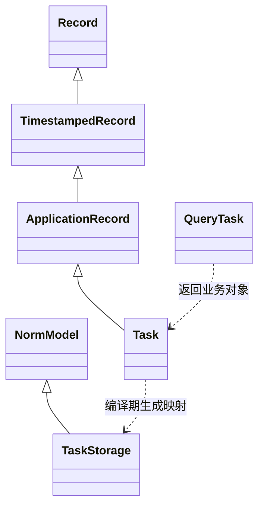

# Leaf Model 基类与数据库能力设计草案

Leaf 的业务 model 通过 `ApplicationRecord` 继承统一的持久化、校验、回调和状态管理能力。数据库映射与基本读写复用 Norm，应用代码使用 `leaf/model` 的稳定接口。应用自动绑定当前数据库上下文，日常 model 操作无需传 db 参数。查询条件由独立的 `Query[T]` 组合，SQL 迁移继续由 Leaf 管理。

本文定义拟新增接口及其行为，供实现前评审；示例尚不是当前 Leaf 的可运行 API。

## 目标与既有约束

用户已选择以 Norm 为底座，要求参考 Rails model 层，并把 model 的共同操作封装到父类；进一步要求日常调用不反复传递 db。成功标准是：新增业务 model 只需声明字段、校验、回调与业务方法，不再重复编写 CRUD SQL 或传递数据库连接；页面能够按字段展示错误；保存失败、取消编辑、事务回滚都不破坏数据库或已展示的记录。

Leaf 当前使用 Nim 2.2.6 及以上、ORC、显式连接注入、SQLite 和版本化 SQL 迁移。现有脚手架的 model 是值类型，CRUD 位于生成的 service；新设计需要处理改用引用类型后的编辑隔离、64 位主键和脚手架兼容性。模块导入和生成命令不得打开数据库。

首版采用 SQLite。PostgreSQL 保留适配边界，但不作为首版支持承诺；不同数据库的锁、受影响行数与迁移行为需要独立验证。

## 与 Rails 的职责对应

Rails 将持久化、校验、回调等能力组合到 Active Record，同时通过 Relation 表示查询。Leaf 参考这些职责与可观察行为，使用 Nim 的泛型过程和编译期元数据实现公共操作。[Active Record 基类](https://api.rubyonrails.org/classes/ActiveRecord/Base.html)、[查询对象](https://api.rubyonrails.org/classes/ActiveRecord/Relation.html)

| Rails 概念 | Leaf 对应 | 职责 |
| --- | --- | --- |
| ActiveRecord Base | Record | 身份、实例状态与共享操作入口 |
| ApplicationRecord | 应用内 ApplicationRecord | 应用共享规则、回调与字段 |
| ActiveRecord Relation | Query[T] | 条件、排序、分页、scope 与查询执行 |
| ActiveModel Errors 与 Validations | ModelErrors 与 validation 模块 | 结构化字段错误及规则组合 |
| Persistence | persistence 模块 | 创建、更新、删除、重载 |
| Callbacks 与 Transactions | callbacks 与 transactions 模块 | 生命周期、保存原子性与提交通知 |
| Dirty | changes 模块 | 原始值、待保存变化、上次保存变化 |
| 数据库适配器 | adapters/norm_sqlite | Norm 存储类型和统一 SQLite 连接 |

父类提供用户可见的共同能力，内部按职责拆成模块。`find` 等类型级操作由 `typedesc[T]` 泛型过程提供；`save` 等实例操作保留具体类型 `T`，让 `Task.find(...)`、`task.save(...)` 都具备正确的字段映射。业务 model 不需要复制这些过程。

## 底层复用方案

有三种可行方案：

1. **Leaf 基类与 Norm 存储类型分开，推荐。** 业务 model 继承 Leaf 基类，编译期自动生成仅包含数据库字段的内部 Norm 类型。需要字段转换与元数据，但能把运行状态留在基类，使用上游 Norm。
2. **业务 model 直接继承 Norm Model，再增加临时字段支持。** 继承层级更短，但必须修改 Norm 的建表、查询、行转换与递归映射路径，长期维护这些改动。
3. **基于现有 leaf/sqlite 完整实现 ORM。** 连接层最容易保留，但需要自行维护对象映射、关联和查询行为，偏离复用成熟库的方向。

选择方案一。Norm 2.8.7 的 `Model.id` 为 `int64`，其映射遍历继承字段；`ro` 仅排除写入，不排除查询或建表，因此不能用它隐藏 `errors` 或快照。Leaf 不直接把带有运行状态的业务对象传给 Norm。[Norm Model 源码](https://github.com/moigagoo/norm/blob/2.8.7/src/norm/model.nim)、[字段 pragma](https://github.com/moigagoo/norm/blob/2.8.7/src/norm/pragmas.nim)

`defineModel(Task)` 自动生成内部存储类型、持久化字段清单、值转换、字段访问器及注册信息。存储类型继承 `norm/model.Model`，使用同一个表名；业务对象与存储对象通过显式字段转换隔离。生成器仅生成 model 声明，不输出一套独立 CRUD 实现。框架不维护全局对象注册表，也不依赖对象地址管理生命周期。

基本插入复用 Norm，查询通过 Norm 的行映射执行编译后的参数化 SQL。更新使用共享适配器对变化字段执行参数化 UPDATE，并检查受影响行数；删除同样检查行数。这两个补充路径解决 Norm 单对象更新没有返回受影响行数的问题，不允许更新失败后偷偷插入新行。[Norm SQLite 源码](https://github.com/moigagoo/norm/blob/2.8.7/src/norm/sqlite.nim)、[lowdb SQLite API](https://github.com/PhilippMDoerner/lowdb/blob/v0.3.0/src/lowdb/sqlite.nim)

## 基类与实例状态



`Record` 管理私有身份和运行状态：原始主键、生命周期、数据库身份、字段错误、数据库值快照、上次保存的变化、回调重入标记和关联缓存。`id` 通过只读访问器公开，类型统一为 `int64`；调用者不能通过普通属性赋值改变已保存记录的身份。

生命周期为 `newRecord`、`persisted`、`destroyed`。普通 `Task(title: ...)` 构造的对象初始状态为 newRecord，首次成功插入后获得主键。查询结果从 persisted 开始；成功删除后变为 destroyed，并保留主键供显示。对 destroyed 对象执行保存或再次删除报 `ModelUsageError`。新对象也不能通过手工指定非零 id 来冒充数据库中的记录。

`TimestampedRecord` 继承 Record，增加持久化字段 `created_at` 和 `updated_at`，类型为 `Option[DateTime]`。新对象字段为空，写入前统一填入 UTC 时间；有实际持久化变化的更新才刷新 updated_at。SQLite 使用 REAL 存储 Unix 秒，与 Norm DateTime 映射一致。

新脚手架的 ApplicationRecord 默认继承 TimestampedRecord；已有无时间字段的表可使用继承 Record 的应用基类，之后通过新迁移逐步加入时间字段。抽象基类不建表；对它调用数据库查询、创建或注册为具体 model 应在编译期失败。首版只允许具体 model 继承抽象基类，不支持具体 model 之间的表继承。

## Model 声明与应用共享规则

```nim
# app/models/application_record.nim
import leaf/model

type ApplicationRecord* = ref object of TimestampedRecord
defineAbstractModel(ApplicationRecord)
```

```nim
# app/models/task.nim
import std/strutils
import leaf/model
import ./application_record

type Task* = ref object of ApplicationRecord
  title*: string
  done*: bool

proc normalizeTitle(task: Task) =
  task.title = task.title.strip()

defineModel(Task, table = "tasks"):
  validates title, presence = true, maxLength = 200
  beforeValidation normalizeTitle
  scope unfinished, it.done == false
```

`defineAbstractModel` 也接受规则、回调和 scope 块，子类按继承顺序获得应用公共规则。scope 声明同时生成模型类型和 Query[T] 的入口，共用一份条件表达式，因此可写 Task.unfinished 和 Task.where(...).unfinished。声明在编译期完成，不产生导入时注册或数据库访问。字段、规则和回调签名在编译期检查；不支持的持久化字段类型直接给出定位到声明的错误。

首版字段支持 string、bool、int、int64、float、DateTime 及这些标量的 Option。长度规则按 Unicode 码点数计算。原有脚手架的 string 必填与 trim、float 必须有限规则保留，但 trim 作为生成的 beforeValidation 回调明确声明，避免所有业务字符串都被默认修改。

具体表名由声明指定，脚手架沿用现有复数规则。首版列名沿用声明中的字段名；没有隐式 camelCase 到 snake_case 转换。内部 id 和时间字段均进入保留名检查，使用 Nim 的标识符等价规则检测冲突。

## 数据库上下文与免传参接口

日常接口从当前执行上下文取得数据库连接，应用启动时配置一次。Rails 的 ConnectionHandling 提供连接管理与作用域切换，Leaf 参考这种职责，把连接选择从业务方法调用移到应用执行边界。[Rails 连接管理](https://api.rubyonrails.org/classes/ActiveRecord/ConnectionHandling.html)

| 可选方式 | 使用体验 | 取舍 |
| --- | --- | --- |
| 应用自动绑定执行上下文 | Task.find(id)、task.save() | 推荐；调用简洁，同线程多个应用及独立测试可隔离 |
| 进程级默认连接 | 启动时设置一个共享 db | 配置简单，但多个应用、测试和后台线程容易争用或切换错连接 |
| 每个记录持有连接 | 已加载对象可直接 save() | 仍需要解决 Task.find 和新对象的连接选择，并延长连接生命周期 |

选择应用绑定的同步执行上下文。createApplication 继续在启动边界接收或打开连接，构造页面与应用时绑定一次；返回的 Application 持有一个 executionScope 通用钩子，Runtime 在渲染、事件处理和延迟内容创建边界调用它。钩子内部执行 withDatabase(applicationDatabase)，结束后恢复前一个上下文。core 只知道通用执行钩子，不导入 ORM 或 SQLite；没有存储的应用不增加数据库依赖。

不能只在 createApplication 或初次 render 时短暂绑定连接：按钮事件在稍后执行，需要单独进入相同上下文。页面 View 与 logic、model 校验回调、service 和事务内的嵌套调用均使用当前连接。Application 的渲染闭包直接调用时也绑定应用上下文；Runtime 的通用钩子负责事件与延迟内容路径，原生和 headless 运行遵守相同契约。

```nim
# 应用启动，连接配置只在这里出现
let app = createApplication() # 打开 config/database 配置的连接
quit(run(app))

# 独立测试或维护脚本，作用域内全部操作免传 db
proc testTaskPersistence() =
  let testDb = openApplicationDatabase(":memory:")
  defer: testDb.close()
  withDatabase(testDb):
    let task = Task.createOrRaise(title = "测试任务", done = false)
    doAssert Task.find(task.id).title == "测试任务"
```

ModelContext 持有借用的 Database 和执行线程信息，当前上下文指针采用 threadvar，在 withDatabase 入口保存前值，在 finally 中恢复，覆盖正常返回、提前退出和异常。进入作用域不打开或关闭连接，也不自动创建事务。作用域可嵌套：退出内层后恢复外层。同线程先后处理不同应用事件时分别绑定对应连接，不存在进程级默认数据库回退。[Nim 线程局部变量](https://nim-lang.org/docs/manual.html#threads-threadvar-pragma)

访问数据库时没有上下文，抛 DatabaseContextError，并提示在应用回调或 withDatabase 中调用；不静默创建数据库。build、生命周期和变更查询不需要上下文；valid 需要上下文，以统一支持读取数据库的业务校验。已保存对象仍保留数据库身份，当前连接不同则拒绝保存或重载；不能为了省参数改写另一个应用的同主键行。

Query 在模型类型的 where、orderBy、limit、offset 或 scope 入口调用时捕获当前实际连接及身份，后续构建条件不重新选择连接。用户不必调用 query()，内部通过统一的查询构造过程完成绑定。终结操作在捕获连接的 withDatabase 中执行，离开最初作用域后仍查询原数据库；连接关闭或线程不符时报错。活动事务内禁止切换到另一连接，包括执行捕获了另一连接的 Query，以免一段业务事务实际写入多个互不原子的数据库。

显式 db 重载保留给底层集成与兼容，例如 Task.find(db, id)、task.save(db)；它们通过 withDatabase(db) 调用同一份公共实现，确保回调及嵌套调用也使用指定连接，遵守相同跨数据库身份和事务切换检查。脚手架与日常文档默认展示免传参接口。

后台工作在所属线程打开自己的连接，再用 withDatabase 包围同步工作，不继承 UI 线程的上下文或连接。首版的 withDatabase 是同步作用域，不能跨 await 或调度器让出执行；后续支持异步时需要任务级上下文，不能将 threadvar 直接当作异步任务隔离机制。

## 共同操作与失败行为

为接近 Rails 的 save 与 save! 语义，普通保存返回布尔结果，显式抛异常版本命名为 saveOrRaise。前面的接口示例据此细化；业务事务应使用抛异常版本。[Rails Persistence](https://api.rubyonrails.org/classes/ActiveRecord/Persistence.html)、[Rails 校验](https://guides.rubyonrails.org/active_record_validations.html)

| 拟新增接口 | 行为 |
| --- | --- |
| T.build(字段参数) | 构造未保存对象，不访问数据库 |
| T.create(字段参数) | 返回对象；校验失败时对象未保存且含 errors |
| T.createOrRaise(字段参数) | 返回已保存对象；校验或回调取消时抛异常 |
| T.find(id) | 返回 T；不存在时抛 RecordNotFound |
| T.findBy(字段条件) | 返回 Option[T]；多条匹配取按 id 升序的第一条 |
| T.findByOrRaise(字段条件) | 返回 T；不存在时抛 RecordNotFound |
| T.where(字段条件或表达式) | 捕获当前连接，返回未执行的 Query[T] |
| T.orderBy(字段表达式, Asc 或 Desc) | 直接开始可组合的排序查询 |
| T.limit(n) / T.offset(n) | 直接开始可组合的分页查询 |
| T.first / T.last | 返回 Option[T]；按有效排序取第一条或最后一条 |
| T.first(n) / T.last(n) | 返回 seq[T]，最多 n 条，保持有效排序顺序 |
| T.firstOrRaise / T.lastOrRaise | 返回 T；不存在时抛 RecordNotFound |
| T.all | 执行查询，返回 seq[T] |
| T.count / T.exists | 直接查询数量或是否有记录 |
| T.exists(id) | 检查指定主键是否存在，返回 bool |
| T.ids / T.pluck(字段表达式) | 返回主键列表或所选字段值列表，不构造 model 对象 |
| record.valid() | 运行校验及校验回调，返回 bool，不自动保存 |
| record.save() | 校验失败或 before 回调取消返回 false；成功返回 true |
| record.saveOrRaise() | 校验失败抛 RecordInvalid；回调取消抛 RecordNotSaved |
| record.update(字段参数) | 赋值后执行 save，返回 bool，保留失败的输入 |
| record.updateOrRaise(字段参数) | 赋值并执行 saveOrRaise |
| record.reload() | 原位重载、清除 errors 与 changes；不存在时报错 |
| record.destroy() | 执行删除回调；取消返回 false，成功返回 true |
| record.destroyOrRaise() | 删除取消时抛 RecordNotDestroyed |
| record.isNewRecord / isPersisted / isDestroyed | 查询实例生命周期 |
| record.changed / changes / savedChanges | 查看待保存变化与上次成功保存的变化 |
| record.dupRecord() | 复制业务字段；重置主键、生命周期、时间字段和运行状态 |

字段参数的构造与赋值接口由声明宏生成，其余操作由公共泛型过程实现。普通 save、update 和 destroy 不隐式吞掉数据库错误，返回值也不标记 discardable，调用者必须处理结果或显式 discard。nil 对象、跨数据库操作和回调重入报 ModelUsageError。

错误集合支持同一字段多条错误，包含字段名、错误代码、参数与显示消息，并提供 `errors.forField("title")` 和 `errors.fullMessages()`。每次校验重新构建错误集合，避免旧错误残留。数据库锁定、只读等错误统一为 DatabaseError；唯一约束、外键及 CHECK 失败为 ConstraintError，保留原始数据库错误信息。首版不提供会有竞态的应用层 uniqueness 校验。

查询结果完整加载持久化字段。首版不提供部分字段加载后继续保存的接口。对未变化的已有对象，仍运行保存回调；回调没有产生变化时不执行 UPDATE、不改变 updated_at，但检查该行仍存在，不存在时报 RecordNotFound。

## 页面使用与编辑隔离

```nim
let task = Task.build(title = "买牛奶", done = false)
if task.save():
  state.selectedId = task.id
else:
  state.error = task.errors.fullMessages().join("\n")

let saved = Task.find(state.selectedId)
saved.done = true
saved.saveOrRaise()
```

页面状态仍然使用独立 Draft 值对象保存输入。开始编辑时复制字段到 Draft；提交时重新查找目标记录，再赋予草稿字段并保存。UI 的列表对象只在成功提交后刷新，写入失败或取消编辑不会通过引用别名修改列表。新对象与编辑对象分别走 build 和 find，不使用 `Task(id: editingId)` 推断保存模式。

schema 2 应用的 id 页面状态和事件闭包使用 int64，schema 1 原有接口继续保持兼容。存储层补充 asInt64 读取接口，避免在 32 位平台经由 int 截断主键。公共操作保留具体业务类型；擦除为 Record 的引用仅用于事务记账和公共状态，不用于推断具体表。

## 查询对象与 Scope

Rails 的模型类型可以直接调用 first、last 和 where，条件查询仍返回可组合的 Relation。Leaf 采用模型类型入口和独立查询描述的结构，取消公开示例中的 query() 起始步骤。[Rails 查询入口](https://guides.rubyonrails.org/active_record_querying.html)、[Rails 首尾查找](https://api.rubyonrails.org/classes/ActiveRecord/FinderMethods.html)

```nim
let firstTask = Task.first
let lastTask = Task.last
let firstThree = Task.first(3)
let lastThree = Task.last(3)

# 简单等值条件，字段名称及值类型在编译期检查
let tasks = Task.where(done = false).all
let task = Task.where(done = false, title = "买牛奶").first

# 比较、组合条件使用表达式
let tasks = Task.where((it.done == false) and (it.id > 10'i64))
  .orderBy(it.id, Desc)
  .limit(20)
  .all

# defineModel 中声明的 scope 也可直接作为起点
let tasks = Task.unfinished.orderBy(it.id, Desc).all
let total = Task.unfinished.count
let first = Task.unfinished.first

# 只读取值，不构造可保存的业务对象
let ids = Task.where(done = false).ids
let titles = Task.where(done = false).pluck(it.title)
let summaries = Task.where(done = false).pluck(it.id, it.title)
```

模型类型和 Query[T] 同时提供 where、orderBy、limit、offset、first、last、count、exists、ids、pluck 以及声明的 scope。类型入口只是创建查询或委托执行的共享包装，不复制 SQL 逻辑，不要求业务 model 手写转发过程。无额外参数的入口支持 Nim 的点调用简写，如 Task.first、Task.last、Task.count；Task.first() 等括号写法同样支持。泛型实例操作保留具体 T，不通过擦除后的 Record 推断表结构。

Query 是不可变的查询描述，每次 where、orderBy、limit、offset 返回新描述，避免两个 scope 分支互相污染。描述只持有连接、字段元数据和表达式树；直到 all、first、last、count、exists、ids、pluck 才执行 SQL。all 返回 seq[T]，不再接受数据库查询链；需要条件或排序时先调用 where、scope 或 orderBy。这里与 Rails 的 all 返回 Relation 有所区别，Leaf 的执行边界保持显式。

单条 first 和 last 返回 Option[T]，firstOrRaise 和 lastOrRaise 不存在时抛 RecordNotFound。未指定排序时按 id 升序，因此 first 是最小 id、last 是最大 id，不代表最早或最近更新。显式排序后按该排序取首尾；为保证相同排序值的分页稳定，尚未包含 id 的排序自动在末尾补 id 升序。last 反转所有有效排序项来查询末尾，返回多条时恢复原排序顺序，不能只反转某一个排序字段。

first(n) 和 last(n) 返回最多 n 条，n 为 0 返回空列表，为负数报 ModelUsageError。若已有 limit 或 offset，先确定该查询描述的分页范围，再取范围内的首尾；不将 last 简化成忽略分页的全表最大 id。没有分页时通过反向排序和 LIMIT 获取末尾，不加载整表。findBy 继续采用 Leaf 的 id 升序首条约定；Rails find_by 本身没有隐含排序，这项差异须在接口文档中注明。

ids 返回 seq[int64]。pluck 单字段返回 seq[字段类型]，多个不同字段返回带字段名的 tuple 列表；可空字段仍是 Option。它们只读取指定数据库列，不构造部分字段的可写 T，并遵守查询排序和分页。调用后不能继续拼接数据库条件。[Rails 字段读取](https://guides.rubyonrails.org/active_record_querying.html#pluck)

where 提供两种形式：命名字段参数用于等值 AND 条件，表达式用于比较、and、or、not、IN 与 NULL 判断。字段必须属于 T，值必须与字段类型兼容；可空字段的 none 映射 IS NULL。命名参数重载不接受任意字符串作为列名，也不与表达式形式在同一次调用中混用，混合场景使用链式 where。所有值参数绑定，标识符取自编译期字段清单并引用。

文本匹配提供预定义 contains、startsWith、endsWith 查询函数，生成 SQL LIKE 并转义输入中的百分号、下划线及转义字符；遵循 SQLite LIKE 的大小写语义，不承诺 Unicode 大小写折叠。它们和 isNull 属于允许的查询函数，其他任意 Nim 函数和原始 SQL 片段不能混入表达式。参数中的中文、引号和 NUL 按原值保留。limit 与 offset 拒绝负数；重复调用替换原值。where 叠加 AND，orderBy 依次追加排序。

count 与 exists 对 where 条件执行统计，忽略排序、分页；这是 Leaf 首版的明确约定，不承诺与 Rails 对所有分页查询的统计语义一致。需要统计当前分页结果时显式使用 all().len。保留受控的参数化 rawQuery 适配入口供复杂 SQL，首版不提供批量 updateAll 或 deleteAll，以免同时引入绕过校验、回调和实例状态的第二套写入规则。

## 校验回调与保存流程

首版回调包括 before/afterValidation、before/afterSave、before/afterCreate、before/afterUpdate、before/afterDestroy、afterCommit、afterRollback。共享规则按抽象基类到具体 model 累积执行；before 回调按基类到子类执行，after 回调按子类到基类执行，同层按声明顺序。该顺序是 Leaf 的显式契约。around、afterFind、afterInitialize 和条件回调留给后续扩展。

保存流程为：检查连接与对象状态 → 开启事务或内部 savepoint → beforeValidation → 校验 → afterValidation → beforeSave → beforeCreate/Update → 计算变化及时间字段 → 写入 → afterCreate/Update → afterSave → 提交。校验失败或 before 回调调用 abortOperation 时回滚本次保存范围并返回 false；抛异常版本将失败转换为相应类型。任何未处理异常同样回滚并向外传播。

删除流程为 beforeDestroy → DELETE → afterDestroy → 提交。不存在的已保存行报 RecordNotFound，不能当作成功。destroyed 状态在写入成功后暂存，外层事务回滚时恢复。

afterSave 表示当前事务内写入已成功，afterCommit 表示最外层事务已提交。提交前不得触发 afterCommit；其异常以 PostCommitError 报告，异常包含 committed=true，数据库已经提交，不执行回滚或自动重试。提交事件按序执行，个别事件失败不跳过其余事件，最终合并报告错误。保存回调不能再次保存同一对象；保存其他对象可通过嵌套 savepoint 参与同一个业务事务。[Rails 回调](https://guides.rubyonrails.org/active_record_callbacks.html)

## 事务与变更追踪

```nim
transaction:
  let project = Project.createOrRaise(name = "家庭")
  discard Task.createOrRaise(
    title = "买牛奶", done = false, project_id = project.id)
```

transaction 使用当前上下文的连接；db.transaction 保留为显式入口，先绑定指定连接再执行相同事务流程。最外层 SQLite 写事务使用 BEGIN IMMEDIATE，嵌套业务事务和内部保存使用 SAVEPOINT。保存失败返回 false 时只回滚本次保存范围；需要整个业务事务失败时使用 saveOrRaise 或主动抛异常。数据库操作和事务记账均绑定同一个实际连接。

每个事务范围在对象首次参与写入时登记运行状态和数据库快照。回滚恢复主键、生命周期、框架维护的时间字段、变化基线和关联缓存；保留用户提交的业务字段值供修正。事务内新建记录回滚后恢复为未保存对象，不残留已经失效的主键。内层提交将日记与提交事件交给外层，内层回滚只恢复内层范围。

提交事件按成功写入操作的顺序保存，附带不可变的操作种类及变化快照。每次成功写入对应一个事件；afterCommit 接收对象和事件，对象可能已经体现该事务中的后续修改，事件提供本次操作的数据。回滚事件在对应范围回滚后发出，事件处理不允许在同一正在回滚的连接上继续写入。回滚处理异常保留原始操作错误，不中断其余状态恢复。

changes 通过当前业务字段与原始快照比较生成，普通属性赋值不需要特殊 setter。新对象所有业务字段都作为待插入值；已有对象只更新实际变化的字段。写入成功后更新快照和 savedChanges，afterSave 中继续修改的字段留在下一次待保存变化中。失败不把未写入值当作新基线。首版没有 identity map，同一行可对应多个对象；未修改字段不会被旧对象覆盖，同时修改同一字段采用最后提交结果。乐观锁为后续能力。[Rails 变更追踪](https://api.rubyonrails.org/classes/ActiveModel/Dirty.html)、[Rails 事务](https://api.rubyonrails.org/classes/ActiveRecord/Transactions/ClassMethods.html)

## 连接与平台适配

保留 leaf/sqlite 的 Database、参数化查询、脚本执行和迁移接口，在私有适配器内把同一个 SQLite C 连接借给 lowdb，所有权仍由 Leaf 持有；Norm 和 lowdb 不负责关闭借用连接。ORM 对外不暴露 lowdb 类型。新对象首次写入成功后绑定数据库身份，跨连接保存或重载该对象报错；跨连接复制业务值时使用 dupRecord。

SQLite 指针只允许在同一 SQLite 库实例之间借用。现有 Windows 绑定使用 winsqlite3.dll，而 db_connector 默认使用 sqlite3_64.dll 或 sqlite3_32.dll，不能只做指针类型转换。适配方案是在锁定的 db_connector SQLite 绑定中增加可配置库名的小补丁，Leaf 模型构建配置将其设为平台当前使用的库名；Windows 保持 winsqlite3.dll。补丁只改变动态库选择，不修改 Norm 的 ORM 行为。[db_connector SQLite 绑定](https://github.com/nim-lang/db_connector/blob/master/src/db_connector/sqlite3.nim)

ORM 查询进入前验证连接未关闭且位于拥有它的线程。原有 busy timeout、foreign_keys、FULLMUTEX、原生参数绑定、NUL 保留与 migration authorizer 继续适用。需要在三平台编译与运行验证共享库和句柄借用；这项验证是接入的第一项技术检查，不能以编译通过替代运行验证。

Norm 以 2.8.7 为初始版本，lowdb 以 v0.3.0 为初始版本；安装及构建依赖通过锁文件固定实际提交。db_connector 的锁定提交和动态库配置补丁一并进入可复现依赖产物。Norm 的多行映射使用 deepCopy，model 应用的编译配置显式启用 deepcopy:on；转换只对不包含 Leaf 运行状态的存储对象执行。SDK 发布包含这些必需源码与许可，通过独立搜索路径供生成应用编译；脚手架生成命令不运行 nimble install，已安装 SDK 中的应用构建不临时下载 ORM 依赖。

## 迁移与脚手架兼容

现有 up/down SQL、leaf_schema_migrations、编译期嵌入和已应用历史检查保持同一套机制。Norm 的自动 createTables 不参与应用启动，避免 model 声明变更绕过迁移。新模型迁移增加时间字段；为已有表补时间字段必须创建新版本并明确旧行的填充值，不允许修改已经应用的 create-table SQL。

脚手架清单升级为 schema 2，增加 model API 版本和时间字段约定。对 schema 1 应用，原有资源生成方式继续有效；生成器按清单版本选择模板，不在新增资源时混入新 model 接口。首版没有自动升级旧应用的命令，已有应用按文档人工迁移，并在单独验证后切换清单；原有文件和迁移历史不自动改写。

schema 2 新应用生成 ApplicationRecord、model 声明、免传 db 操作 model 的页面逻辑和 model 测试；页面组预加载 leaf/model 与业务 model。应用执行边界自动绑定数据库上下文，独立测试使用 withDatabase。service 由跨模型业务流程按需创建，普通 CRUD 不再生成存储 service。旧 schema 1 继续使用其原有 service。运行、测试与生成文档必须说明两种清单版本的差异。

## 首版范围与后续扩展

首版交付一个完整的基类与持久化闭环：上述基类、声明宏、应用数据库上下文、免传参 CRUD、结构化校验、明确的生命周期回调、变更追踪、SQLite 事务、基础查询与 scope、schema 2 脚手架及三平台依赖适配。

关联作为后续独立增量：先使用显式 project_id 外键保存关系，再增加 belongsTo、hasMany、关联 Query 和批量 preload。声明应生成 project()、tasks() 之类的访问方法，使用当前上下文并检查所属数据库身份，避免读取普通字段触发数据库访问；preload 在一个父查询加每种关联一次批量查询内加载，不能退化成逐行查询。然后再考虑 join model 的多对多、关联删除策略和嵌套保存。这些扩展不改变 Record 的共同保存入口。

STI、多态关联、自动级联保存、进程级默认数据库、部分字段可写对象、复合主键、乐观锁、异步数据库、复杂聚合 DSL 与批量写入均不属于首版。

## 模块与验证要求

公共入口为 src/leaf/model.nim。实现拆分到 model/record、context、metadata、declarations、validation、errors、persistence、query、callbacks、changes、transactions 和 adapters/norm_sqlite；每个模块围绕单一职责，避免继续扩大 scaffold_templates。core 提供不依赖数据库的 executionScope 通用钩子。生成器的 model 声明模板与页面逻辑模板分别维护。

实施时必须验证以下可观察行为：

1. 两个不同业务 model 继承同一 ApplicationRecord，所有公共操作可复用；父类运行状态不进入表列，共享规则按规定继承。
2. 中文、引号、NUL、NULL、64 位大 id 和 DateTime 往返；错误字段类型和非法查询表达式在编译期失败。
3. 无效 create/save 返回未保存对象与字段错误；抛异常版本、约束失败、只读、锁定和行已删除行为符合约定。
4. 引用别名、修改后取消、保存失败、dupRecord、reload、删除后保存和回调重入都不破坏已展示或已保存数据。
5. Query 分支互不影响、scope 可组合、分页顺序稳定、first 返回 Option、统计语义和参数绑定符合约定。
6. 回调执行顺序、父子规则组合、时间戳更新、afterSave 内继续修改字段及实际变化字段写入。
7. 独立保存、嵌套 savepoint、多记录事务、回滚后的新对象 id 和旧对象变化基线、afterCommit 延迟及提交后异常。
8. 保存两个同一行的独立对象时，未修改字段保持数据库最新值；确认首版同字段最后提交语义。
9. 迁移与 ORM 共享连接，内存库共用，关闭连接报错、借用句柄不重复关闭、动态库一致；Linux、macOS 和 Windows 均运行验证。
10. schema 1 应用继续增量生成；schema 2 应用实际生成、编译和 headless CRUD；迁移历史不被改写，旧记录可保留。
11. 发布 SDK 在无 Nimble 全局缓存、无临时网络下载的环境中编译 model 应用，并包含必需的依赖源码和许可证。
12. 原生与 headless 的初始化、渲染、延迟内容和稍后执行的事件均可免传 db；同线程两个应用交替执行时分别访问所属数据库。
13. withDatabase 嵌套、异常和提前返回均恢复前值，独立测试不污染下一测试；没有上下文、跨线程使用和事务中切换连接明确报错。
14. Query 离开创建作用域后继续使用捕获连接；在另一数据库上下文中执行时不被改路由，关闭连接后拒绝执行；显式重载的回调与嵌套操作使用指定连接。
15. 模型类型直接调用 where、first、last、orderBy、count 和 scope，与 Query[T] 同名操作共享行为；带括号和点调用简写都通过编译验证。
16. first/last 的默认主键排序、显式多字段排序、相同排序值、首尾 n 条、分页范围、空表和负数参数均符合约定；last 不查询整表。
17. 命名字段 where、表达式 where、文本转义、模型类型和查询对象上的 scope 均可组合；ids 与 pluck 只返回所选值，不产生可保存的半加载对象。

实现前先验证存储类型生成、继承元数据和共享连接；只有这些基础通过，才继续完整持久化和脚手架接入。后续实现计划应按这些依赖关系安排工作。
